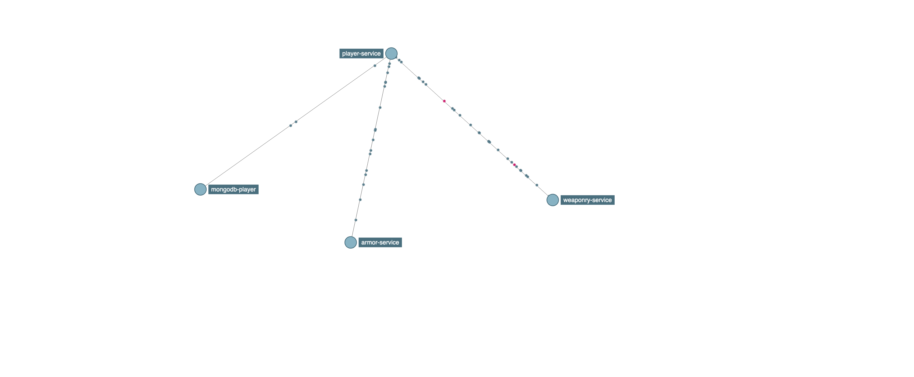

# Distributed Traces Demo

It's a Gradle multi modules project

There are 3 different microservices in this project:
* Player Service - creates a player.
* Armor Service - gives different armors to the player.
* Weaponry Service  - gives weapon to a player.

## Tech Stack
* Java-11
* Spring Boot-2.5.3
* MongoDB
* Gradle